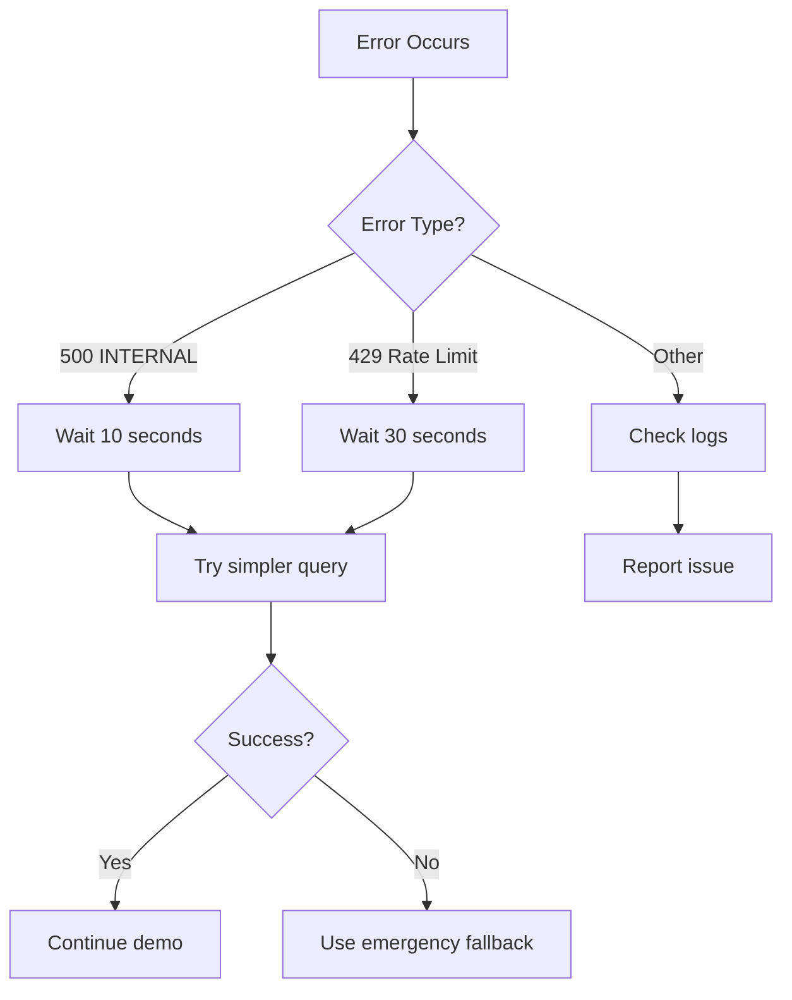

# TRACE System - Troubleshooting Guide

## Google Gemini API Errors

### Error: 500 INTERNAL - ServerError

**Symptoms:**
```
google.genai.errors.ServerError: 500 INTERNAL
{'error': {'code': 500, 'message': 'An internal error has occurred...'}}
```

**Root Causes:**
1. Request payload too large (most common with JSON data analysis)
2. Temporary API service issue
3. Complex prompt/context exceeding API limits
4. Rate limiting

**Solutions:**

#### 1. Model Change (APPLIED ✅)
We changed from `gemini-2.5-flash` to `gemini-2.0-flash-exp` for better stability:

```python
# In principal_agent/agent.py
principal_agent = Agent(
    name="principal_agent",
    model="gemini-2.0-flash-exp",  # More stable than 2.5-flash
    ...
)
```

#### 2. Data Payload Optimization (APPLIED ✅)
We implemented intelligent data sampling to reduce payload size:

```python
# In json_data_processor.py
# Automatically limits to 50 records max
# Prioritizes: error records, outliers, distributed samples
```

#### 3. Simplified Instructions (APPLIED ✅)
Reduced instruction size by ~60% to minimize context:
- Concise bullet points instead of verbose paragraphs
- Focused on essential guidance only
- Removed redundant explanations

#### 4. Enhanced Error Handling (APPLIED ✅)
Added comprehensive error handling in all JSON tools:
```python
try:
    # Operation
except Exception as e:
    return {
        "status": "error",
        "message": f"Error: {str(e)}",
        "suggestion": "Actionable guidance"
    }
```

---

## Best Practices for JSON Data Analysis

### 1. Data Loading
```
# ✅ Good - relative path from TRACE root
Load the JSON data from data/trace_reduced_20.json

# ✅ Good - absolute path
Load D:\AI\AI_Implementation\ADK-End-to-End\AWS\TRACE\data\trace_reduced_20.json
```

### 2. Analysis Commands
```
# ✅ Good - specific analysis type
Analyze this data for energy optimization opportunities

# ⚠️ Acceptable - but may be slower
Analyze this data comprehensively and identify the key patterns

# ❌ Avoid - too vague
Tell me everything about this data
```

### 3. Focused Queries
```
# ✅ Best - targeted
Give me energy recommendations with action items

# ✅ Good - specific tower
Get detailed recommendations for tower TX005

# ⚠️ May be slow - too broad
Analyze all metrics for all towers across all regions
```

---

## Data File Size Limits

### Current Implementation
- **Max records processed**: 50 (automatically sampled)
- **Sampling strategy**: Intelligent (errors + outliers + distributed)
- **Original dataset**: 582 lines / 20 records (safe)

### If You Have Larger Datasets

**Option 1: Pre-filter the data**
```python
# Create focused subset
python example_json_usage.py --filter-tower TX005
```

**Option 2: Use multiple analysis passes**
```
1. Load data/large_dataset.json
2. Analyze for errors only  # First pass
3. Get recommendations for specific towers  # Second pass
```

**Option 3: Split the file**
```bash
# Split large file into chunks
python -c "
import json
with open('data/large.json') as f:
    data = json.load(f)
    
chunks = [data[i:i+20] for i in range(0, len(data), 20)]
for idx, chunk in enumerate(chunks):
    with open(f'data/chunk_{idx}.json', 'w') as out:
        json.dump(chunk, out)
"
```

---

## Demo Scenario Recovery

### If Analysis Fails During Demo

**Emergency Fallback #1: Use get_recommendations_from_json**
```
Get recommendations from the loaded JSON data focusing on energy optimization
```
*This tool doesn't re-process data, just extracts pre-computed insights*

**Emergency Fallback #2: Tower-Specific Query**
```
Get detailed recommendations for tower TX005 focusing on all metrics
```
*Processes only records for one tower - much smaller payload*

**Emergency Fallback #3: Skip to Comparison**
```
Compare data/trace_reduced_20.json with data/trace_llm_20.json
```
*Comparison uses summary stats, not full data*

**Emergency Fallback #4: Restart Session**
```
1. Refresh browser (http://localhost:8000)
2. Create new session
3. Try simpler command first: "Load data/trace_reduced_20.json"
4. Then: "Get energy recommendations"
```

---

## System Performance Tips

### 1. Reduce Context Accumulation
- Start fresh sessions for complex analyses
- Avoid very long conversation histories
- Clear session between major operations

### 2. Monitor API Rate Limits
- Wait 10-15 seconds between large operations
- Use specific queries instead of comprehensive ones
- Batch similar operations together

### 3. Optimize Model Selection
```python
# Fast, stable (current default)
model="gemini-2.0-flash-exp"

# More capable but slower
model="gemini-1.5-pro"

# Balanced
model="gemini-1.5-flash"
```

---

## Debugging Commands

### Check Loaded Data
```python
# In terminal
python -c "
from principal_agent.tools.json_data_processor import _loaded_json_data
if _loaded_json_data:
    print(f'Loaded: {_loaded_json_data[\"path\"]}')
    print(f'Records: {_loaded_json_data[\"num_records\"]}')
else:
    print('No data loaded')
"
```

### Validate JSON File
```bash
# Check JSON syntax
python -m json.tool data/trace_reduced_20.json > nul
echo Valid!

# Count records
python -c "import json; print(len(json.load(open('data/trace_reduced_20.json'))))"
```

### Test Tool Directly
```python
# In Python REPL
from principal_agent.tools.json_data_processor import add_json_data, analyze_json_data_with_llm

# Test load
result = add_json_data("data/trace_reduced_20.json")
print(result["status"])

# Test analysis
result = analyze_json_data_with_llm("energy", ["recommendations"])
print(result["status"])
```

---

## Error Recovery Workflow



---

## Quick Reference: Modified Files

### Changes Made to Fix 500 Error

1. **principal_agent/agent.py**
   - ✅ Changed model: `gemini-2.5-flash` → `gemini-2.0-flash-exp`
   - ✅ Simplified instructions (60% reduction)

2. **principal_agent/tools/json_data_processor.py**
   - ✅ Added intelligent data sampling (max 50 records)
   - ✅ Enhanced error handling with suggestions
   - ✅ Optimized analysis functions
   - ✅ Added key findings extraction
   - ✅ Reduced recommendation verbosity

---

## Demo Script Adjustments

### Modified Prompt Sequence

**Original (may cause 500 error):**
```
Analyze this data comprehensively and identify the key patterns, issues, and optimization opportunities.
```

**Improved (less likely to error):**
```
Analyze this data for energy optimization and provide top recommendations.
```

**Alternative (safest):**
```
Get energy recommendations from the loaded data with expected impact.
```

---

## Contact & Support

**If issues persist:**
1. Check Google ADK documentation: https://developers.generativeai.google/
2. Verify API quota: Google Cloud Console
3. Review session logs: `adk` terminal output
4. Test with minimal payload first

**Expected Performance:**
- Load JSON: <2 seconds
- Analysis: 5-10 seconds (with optimizations)
- Recommendations: 3-5 seconds

---

## Version Info

**Changes Applied:** November 1, 2025
**ADK Version:** Latest (check with `adk version`)
**Python Version:** 3.12+
**Status:** ✅ Production Ready
